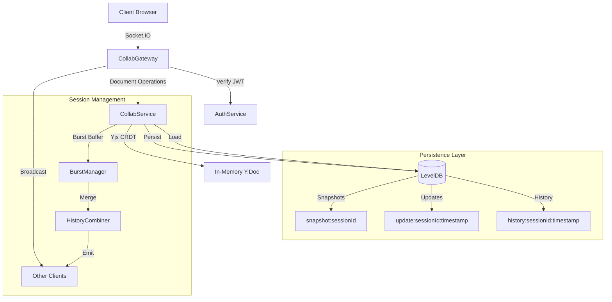

## Table of Contents

- [Overview](#peerprep-collaboration-service)
- [Architecture Overview](#architecture-overview)
- [Socket.IO Events](#socketio-namespace--events)
- [Persistence](#persistence)
- [Development Notes](#development-notes)
- [Testing / Linting](#testing--linting)
- [Related Services](#related-services)
- [Contributors](#contributors)

# PeerPrep Collaboration Service

A real-time collaborative code editing microservice built with NestJS, Socket.IO, and Yjs. Enables multiple users to edit code simultaneously with conflict-free synchronization, edit history tracking, and persistence.

## Architecture Overview

The Collaboration Service uses **Yjs** (a CRDT library) for conflict-free concurrent editing, **Socket.IO** for real-time WebSocket communication, and **LevelDB** for persistent storage. The architecture consists of:

- **CollabGateway**: Handles WebSocket connections, authentication, and real-time event routing
- **CollabService**: Manages Yjs documents, session state, and persistence logic
- **AuthService**: JWT token verification using Supabase credentials
- **Burst Manager**: Batches rapid typing changes into consolidated history records
- **History Combiner**: Merges adjacent edits for cleaner history presentation
- **LevelDB**: Stores document snapshots, incremental updates, and edit history



## Tech Stack

| Component          | Technology              | Version     |
| ------------------ | ----------------------- | ----------- |
| **Framework**      | NestJS                  | ^10.0.0     |
| **Runtime**        | Node.js                 | 20 (Alpine) |
| **WebSocket**      | Socket.IO               | ^4.8.1      |
| **CRDT Engine**    | Yjs                     | ^13.6.27    |
| **CRDT Protocols** | y-protocols             | ^1.0.6      |
| **Database**       | classic-level (LevelDB) | ^3.0.0      |
| **Authentication** | jsonwebtoken            | ^9.0.2      |
| **Language**       | TypeScript              | ^5.1.3      |
| **Testing**        | Jest                    | ^29.5.0     |

## Socket.IO Namespace & Events

**Namespace:** `/collab`

**Transport:** WebSocket only (polling disabled)

### Events Reference

| Event                 | Direction       | Description                                                           |
| --------------------- | --------------- | --------------------------------------------------------------------- |
| `collab:connected`    | Server → Client | Confirmation of successful connection with `userId` and `sessionId`   |
| `collab:state`        | Server → Client | Full document state (Yjs encoded) sent on join or after revert        |
| `collab:language`     | Server → Client | Current programming language for the session                          |
| `collab:update`       | Client → Server | Incremental Yjs document update from client                           |
| `collab:update`       | Server → Client | Broadcast of Yjs update to other clients in session                   |
| `collab:awareness`    | Client → Server | Awareness update (cursor position, selection, user info)              |
| `collab:awareness`    | Server → Client | Broadcast of awareness data to other clients                          |
| `collab:history:get`  | Client → Server | Request edit history with optional `limit` parameter                  |
| `collab:history`      | Server → Client | Array of `EditHistoryRecord` objects                                  |
| `collab:history:new`  | Server → Client | Real-time broadcast of new merged edit record                         |
| `collab:language:set` | Client → Server | Set programming language (`python`, `javascript`, `java`, `cpp`, `c`) |
| `collab:revert`       | Client → Server | Revert document to specific `timestamp`                               |
| `collab:listAllRooms` | Client → Server | Debug: List all active Socket.IO rooms                                |
| `collab:roomDetails`  | Server → Client | Debug: Room membership details                                        |
| `collab:error`        | Server → Client | Error message with `ok: false` and `message`                          |

### Connection Handshake

Clients must provide authentication data in the handshake:

```typescript
const socket = io('http://localhost:3002/collab', {
  transports: ['websocket'],
  auth: {
    token: '<JWT_TOKEN>', // Supabase JWT
    sessionId: '<SESSION_ID>', // Collaboration room ID
  },
});
```

## Getting Started

### Prerequisites

- **Node.js** 20 or higher
- **npm** 9 or higher
- **Docker** (optional, for containerized deployment)

### Installation

```bash
# Navigate to the collab-service directory
cd backend/collab-service

# Install dependencies
npm install
```

### Running Locally

```bash
# Development mode with hot-reload
npm run start:dev

# Production mode
npm run build
npm run start:prod

# Debug mode
npm run start:debug
```

The service will start on **port 3002** by default (configurable via `PORT` environment variable).

### Running via Docker Compose

From the `backend/` directory:

```bash
# Build and start all services
docker-compose up --build

# Start collab service only
docker-compose up collab

# Run in background
docker-compose up -d collab
```

The service is exposed on **host port 3002**, mapped to container port 3000.

### Port Configuration

- **Default port**: 3002 (configurable via `PORT` env var)
- **Docker container**: Runs on port 3000 internally, exposed as 3002 on host
- **Health check endpoint**: `http://localhost:3002/health`

## Environment Variables

Create a `.env` file in `backend/collab-service/`:

```env
# Server Configuration
PORT=3002
NODE_ENV=development

# CORS Configuration
# Comma-separated list of allowed origins
CORS_ORIGINS=http://localhost:3000,http://localhost:3001

# Authentication
# Supabase JWT secret for token verification
SUPABASE_JWT_SECRET=your_supabase_jwt_secret_here

# Persistence
# Path to LevelDB storage directory
COLLAB_SERVICE_PATH=./collab-level-db
```

### Environment Variable Details

| Variable              | Required | Default       | Description                               |
| --------------------- | -------- | ------------- | ----------------------------------------- |
| `PORT`                | No       | 3002          | HTTP/WebSocket server port                |
| `CORS_ORIGINS`        | No       | _(allow all)_ | Comma-separated allowed origins           |
| `SUPABASE_JWT_SECRET` | **Yes**  | —             | Secret key for JWT verification (HS256)   |
| `COLLAB_SERVICE_PATH` | **Yes**  | —             | Directory path for LevelDB database files |

## Persistence

### Storage Engine

The service uses **LevelDB** (via `classic-level`) for persistent storage. LevelDB is a fast key-value store that provides:

- Ordered key iteration
- Atomic batch operations
- Compression
- Crash recovery

### Data Model

Three types of keys are stored:

#### 1. Snapshots

**Key:** `snapshot:<sessionId>`  
**Value:** Full Yjs document state (Uint8Array)  
**Purpose:** Periodic snapshots for faster loading

#### 2. Updates

**Key:** `update:<sessionId>:<timestamp>:<random>`  
**Value:** Incremental Yjs update (Uint8Array)  
**Purpose:** Track all document changes since last snapshot

#### 3. History

**Key:** `history:<sessionId>:<timestamp>:<random>`  
**Value:** JSON-encoded `EditHistoryRecord`  
**Purpose:** Human-readable edit history with user attribution

### Persistence Strategy

- **Snapshot interval**: Every **30 seconds** or **200 operations** (configurable)
- **Update pruning**: Updates older than **60 seconds** are deleted after snapshotting
- **History merging**: Adjacent edits within **1.2 seconds** by the same user are combined
- **Burst buffering**: Rapid typing is batched with **1 second** pause threshold

### Database Location

- **Local development**: `./collab-level-db/` (relative to service root)
- **Docker deployment**: Mounted to `./collab-level-db/` on host, mapped to `/data/leveldb` in container

## Development Notes

### Project Structure

```
src/
├── main.ts                    # Application entry point, CORS, port config
├── app.module.ts              # Root module, imports CollabModule
├── app.controller.ts          # Basic app controller
├── app.service.ts             # Basic app service
├── health/
│   └── health.controller.ts   # Health check endpoint (/health)
├── auth/
│   └── auth.service.ts        # JWT verification with Supabase
└── collab/
    ├── collab.module.ts       # Collaboration module definition
    ├── collab.gateway.ts      # Socket.IO gateway, event handlers
    ├── collab.service.ts      # Core Yjs document management
    ├── types.ts               # TypeScript interfaces
    ├── helpers.ts             # Constants, utility functions
    ├── burst-manager.ts       # Real-time edit batching
    └── history-combiner.ts    # History merging algorithms
```

### Key Configuration Constants

Defined in `src/collab/helpers.ts`:

```typescript
TYPE_BURST_MS = 1000; // Typing pause threshold (1s)
MAX_BURST_MS = 5000; // Maximum burst duration (5s)
SNAPSHOT_INTERVAL_MS = 30000; // Snapshot interval (30s)
OPERATIONS_THRESHOLD = 200; // Operations before snapshot
PRUNE_THRESHOLD_MS = 60000; // Update retention (1m)
MAX_SNIPPET_LENGTH = 120; // Max chars in history snippets
MERGE_WINDOW_MS = 1200; // History merge window (1.2s)
ALLOWED_LANGUAGES = ['python', 'javascript', 'java', 'cpp', 'c'];
```

### Rate Limiting & Optimization

- **Burst buffering**: Groups rapid edits to reduce history clutter
- **Snapshot strategy**: Balances memory and disk usage
- **Prune old updates**: Keeps database size manageable
- **History merging**: Combines adjacent single-character edits

### Logging

Uses NestJS built-in logger:

```typescript
this.log.log('Loaded snapshot for session ${sessionId}');
this.log.error('Failed to apply update: ${error}');
```

### Revert Mechanism

The service supports time-travel debugging via `collab:revert`:

1. **Hard revert** (implemented): Rebuilds document from updates up to timestamp, prunes forward history

## Testing / Linting

```bash
# Run unit tests
npm run test

# Run tests in watch mode
npm run test:watch

# Generate coverage report
npm run test:cov

# Run e2e tests
npm run test:e2e

# Run linter
npm run lint

# Format code
npm run format
```

### Test Configuration

- **Framework**: Jest
- **Config**: `jest` section in `package.json`
- **E2E config**: `test/jest-e2e.json`
- **Coverage**: Saved to `coverage/` directory

## Related Services

The Collaboration Service is part of the **PeerPrep** microservices architecture:

| Service              | Port | Purpose                                |
| -------------------- | ---- | -------------------------------------- |
| **Matching Service** | 3001 | Pairs users for collaborative sessions |
| **Collab Service**   | 3002 | Real-time code editing (this service)  |
| **Question Service** | 3000 | Manages coding questions and attempts  |
| **User Service**     | 4001 | User authentication and profiles       |

All services communicate via HTTP/WebSocket and share Supabase JWT tokens for authentication.

## Contributors

| Name         | Role                 |
| ------------ | -------------------- |
| David Vicedo | Lead Developer       |
| Amos Chee    | Frontend Integration |
