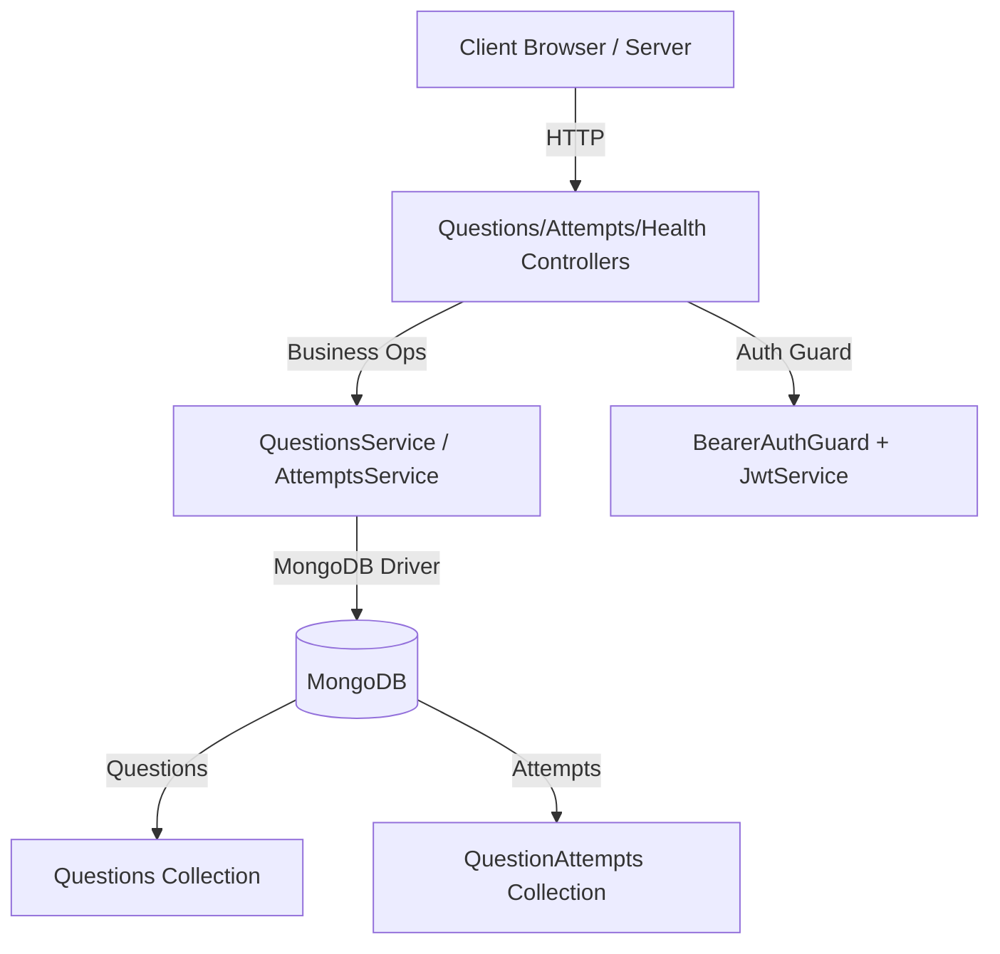

# PeerPrep Question Service

A NestJS microservice that provides searchable coding questions and user attempt tracking over HTTP. Backed by MongoDB with JWT-based authentication.

## Table of Contents

- [Overview](#peerprep-question-service)
- [Architecture Overview](#architecture-overview)
- [REST API](#rest-api)
- [Persistence](#persistence)
- [Getting Started](#getting-started)
- [Development Notes](#development-notes)
- [Testing / Linting](#testing--linting)
- [Related Services](#related-services)
- [Contributors](#contributors)

## Architecture Overview

The Question Service exposes REST endpoints for listing/searching questions, retrieving a question by id, creating attempts, and listing attempts for a user. It uses MongoDB for persistence and validates Supabase-issued JWTs for protected routes.

- QuestionsController, AttemptsController, HealthController: HTTP route handlers
- QuestionsService, AttemptsService: Query and data operations
- MongoDB Provider: Connection, DB, and collection provisioning
- BearerAuthGuard + JwtService: HS256 JWT verification (Supabase-compatible)



## Tech Stack

| Component           | Technology    | Version     |
| ------------------- | ------------- | ----------- |
| Framework           | NestJS        | ^11.0.1     |
| Runtime             | Node.js       | 20          |
| Database            | MongoDB       | ^6.x driver |
| Auth                | jose (JWT)    | ^6.1.0      |
| Language            | TypeScript    | ^5.7.x      |
| Testing             | Jest + ts-jest| configured  |

## REST API

Base URL: `http://localhost:3000` (configurable via `PORT`)

Auth: All endpoints except health require `Authorization: Bearer <JWT>` (Supabase-compatible, HS256).

- GET `/healthz` and `/health` (public)
  - Liveness and Mongo connectivity
  - Response: `{ status, uptime, service: "QuestionService", mongo: { status }, timestamp }`

- GET `/questions` (auth)
  - Paginated list with filters and sorting
  - Query params:
    - `page` (default 1), `pageSize` (default 20), `limit` (alias for pageSize)
    - `topic`: case-insensitive exact token match against `related_topics` (array or comma-separated string)
    - `difficulty`: `easy` | `medium` | `hard` (case-insensitive)
    - `q`: search term
      - case-sensitive partial on `title`
      - partial match on numeric `id` via `$toString`
      - also matches `related_topics`, `topic`, `category`, `dataStructures`, `tags` (partial, case-insensitive)
    - `sortBy`: one of `title`, `topic`, `related_topics`, `difficulty`, `popularity`, `likes`, `discuss_count`, `solve_rate`, `solverate`, `acceptance_rate`, `frequency`, `rating`, `id`
    - `sortDir`: `asc` (default) or `desc`
  - Response: `{ items: QuestionWithPoints[], total, page, pageSize }`
    - Each item includes computed `points`: easy=1, medium=3, hard=5
  - Sorting note: `difficulty` sorts by rank Easy(1) < Medium(2) < Hard(3), then `title` asc

- GET `/questions/:id` (auth)
  - Exact numeric `id`
  - 404 if not found
  - Response: `QuestionWithPoints`

- POST `/attempts` (auth)
  - Records a question attempt
  - Body:
    - `question_id` (string|number, required)
    - `status` (string, default `left`)
    - `started_at` (ISO string, default now)
    - `submitted_at` (ISO string, default now)
    - `question` (object, optional snapshot)
  - Response: created document including `user_id` from JWT

- GET `/attempts` (auth)
  - Lists attempts for the authenticated user
  - Query params: `page`, `pageSize`
  - Response: `{ items, total, page, pageSize }` (sorted by `created_at` desc)

Example requests:

- List questions:
  - `curl -H "Authorization: Bearer $TOKEN" "http://localhost:3000/questions"`
- Filter by topic:
  - `curl -H "Authorization: Bearer $TOKEN" "http://localhost:3000/questions?topic=Two%20Pointers"`
- Sort by likes desc:
  - `curl -H "Authorization: Bearer $TOKEN" "http://localhost:3000/questions?sortBy=likes&sortDir=desc"`
- Get by id:
  - `curl -H "Authorization: Bearer $TOKEN" "http://localhost:3000/questions/11"`
- Create attempt:
  - `curl -H "Authorization: Bearer $TOKEN" -H "Content-Type: application/json" -d '{"question_id":"11","status":"completed"}' http://localhost:3000/attempts`
- List attempts:
  - `curl -H "Authorization: Bearer $TOKEN" "http://localhost:3000/attempts?page=1&pageSize=20"`

## Persistence

- Database: MongoDB
- Collections:
  - Questions: `MONGODB_COLLECTION` or `QUESTIONS_COLLECTION_NAME` (default `Questions`)
  - Attempts: `ATTEMPTS_COLLECTION_NAME` or `MONGODB_ATTEMPTS_COLLECTION` (default `QuestionAttempts`)
- Question fields used by service:
  - `id` (number), `title` (string), `difficulty` (easy/medium/hard), `related_topics` (array or CSV string)
  - Optional sort/search signals: `likes`, `discuss_count`, `acceptance_rate`, `frequency`, `rating`, etc.
- Attempts document shape:
  - `user_id` (string), `question_id` (string), `status` (string), `started_at` (Date), `submitted_at` (Date|null), `question` (object|null), `created_at` (Date)

## Getting Started

Prerequisites
- Node.js 20+, npm 9+
- MongoDB and connection string

Installation
- `cd backend/qn-service`
- `npm install`

Running Locally
- Dev: `npm run start:dev`
- Prod: `npm run build && npm run start:prod`
- Debug: `npm run start:debug`
- Default port: 3000 (env `PORT`)

Docker Compose (from `backend/`)
- All services: `docker-compose up --build`
- Only question service: `docker-compose up qn`
- Detached: `docker-compose up -d qn`
- Port mapping: host 3000 → container 3000

Environment Variables (.env in `backend/qn-service/`)
- Server
  - `PORT`=3000
  - `NODE_ENV`=development
  - `CORS_ORIGINS`=http://localhost:3000,http://localhost:3001
- Mongo
  - `MONGODB_URI`=mongodb://...
  - `MONGODB_NAME`=QuestionService
  - `MONGODB_COLLECTION` or `QUESTIONS_COLLECTION_NAME`=Questions
  - `ATTEMPTS_COLLECTION_NAME` or `MONGODB_ATTEMPTS_COLLECTION`=QuestionAttempts
- Auth (Supabase-compatible)
  - `SUPABASE_JWT_SECRET`=your_supabase_jwt_secret_here
  - `SUPABASE_JWT_AUD`=authenticated
  - `SUPABASE_ISS`=https://your-project.supabase.co/auth/v1

Seed Attempts (optional)
- `QN_TOKEN` must be set to a valid JWT
- `node backend/qn-service/scripts/seed_attempts.js [COUNT]`
- Optional: `QN_BASE_URL` (default `http://localhost:3000`)

## Development Notes

Project Structure
- `src/app.module.ts` — root wiring
- `src/main.ts` — bootstrap, CORS, port
- `src/health/*` — health endpoints
- `src/auth/*` — BearerGuard + jose-based JWT verification
- `src/mongodb/*` — Mongo providers (client, DB, collections)
- `src/questions/*` — questions REST layer (search, by-id)
- `src/attempts/*` — attempts REST layer (create, list by user)

Behavior Highlights
- Difficulty points: easy=1, medium=3, hard=5
- Sorting: difficulty uses rank; others sort by field then title
- Search:
  - title: case-sensitive partial
  - id: partial on stringified numeric id
  - topical fields: partial, case-insensitive across related names

Logging
- Uses Nest defaults; service logs to stdout on start

## Testing / Linting

- Unit tests: `npm run test`
- Watch: `npm run test:watch`
- Coverage: `npm run test:cov` (outputs to `coverage/`)
- E2E: `npm run test:e2e`
- Lint: `npm run lint`
- Format: `npm run format`

## Related Services

| Service              | Port | Purpose                                |
| -------------------- | ---- | -------------------------------------- |
| Matching Service     | 3001 | Pairs users for collaborative sessions |
| Collab Service       | 3002 | Real-time code editing                 |
| Question Service     | 3000 | Questions search and attempts (this)   |
| User Service         | 4001 | User authentication and profiles       |

All services share Supabase JWT tokens for authentication where applicable.

## Contributors

| Name         | Role                 |
| ------------ | -------------------- |
| David Vicedo | Lead Developer       |
| Amos Chee    | Frontend Integration |


# Question Service — Query Guide

This service exposes endpoints to search questions and record/fetch user question attempts, backed by MongoDB.

Base URL: `http://localhost:${PORT}` (defaults to `3000`)

Auth: Most routes require `Authorization: Bearer <JWT>` (guarded by `BearerAuthGuard`). The health endpoint is public.

## Health

GET `/healthz` (public)

- Returns basic liveness and Mongo connectivity.
- Response example:

```json
{
  "status": "ok",
  "uptime": 12.345,
  "service": "QuestionService",
  "mongo": { "status": "ok" },
  "timestamp": "2025-01-01T00:00:00.000Z"
}
```

## Endpoints

GET `/questions`

- Returns a paginated list of questions with optional filtering, search, and sorting.
- Response shape: `{ items: QuestionWithPoints[], total: number, page: number, pageSize: number }`
- Each item includes a computed `points` field derived from `difficulty`.

Points mapping:
- `easy` → `1`
- `medium` → `3`
- `hard` → `5`

## Query Parameters

- `page` (number): Page number. Default `1`.
- `pageSize` (number): Items per page. Default `20`.
- `limit` (number): Legacy alias mapped to `pageSize` if provided.
- `topic` (string): Filter by a single topic. Matches either
  - comma-separated `related_topics` string, or
  - `related_topics` array.
  Case-insensitive exact token match (e.g., `Array` matches `Array, Two Pointers`).
- `difficulty` (string): One of `easy`, `medium`, `hard` (case-insensitive exact match).
- `q` (string): Search term applied as:
  - case-sensitive, partial match on `title`
  - partial, string-based match on numeric `id` (via `$toString`), e.g., `q=11` matches `11`, `110`, etc.
  Note: Does not search Mongo `_id`.
- `sortBy` (string): Sort field. Supported values (case-insensitive):
  - `title`, `topic`, `related_topics`, `difficulty`, `popularity`, `likes`,
    `discuss_count`, `solve_rate`, `solverate`, `acceptance_rate`, `frequency`, `rating`, `id`
- `sortDir` (string): `asc` (default) or `desc`.

Sorting details:
- Default sort is `title` ascending.
- Sorting by `difficulty` uses rank: Easy (1) < Medium (2) < Hard (3), then `title` asc as a tiebreaker.
- Other sorts use the chosen field then `title` asc as tiebreaker.

## Examples

Assume the service runs on `http://localhost:3000` and you have a valid JWT in `$TOKEN`.

List first page (20 items, default sort title asc):

```bash
curl -H "Authorization: Bearer $TOKEN" \
  "http://localhost:3000/questions"
```

Top 5 (using `limit` alias):

```bash
curl -H "Authorization: Bearer $TOKEN" \
  "http://localhost:3000/questions?limit=5"
```

Search by title substring (case-sensitive):

```bash
curl -H "Authorization: Bearer $TOKEN" \
  "http://localhost:3000/questions?q=Container"
```

Search by numeric id substring (e.g., matches 11, 110, 211):

```bash
curl -H "Authorization: Bearer $TOKEN" \
  "http://localhost:3000/questions?q=11"
```

Filter by topic (matches token within comma list or array):

```bash
curl -H "Authorization: Bearer $TOKEN" \
  "http://localhost:3000/questions?topic=Two%20Pointers"
```

Filter by difficulty (case-insensitive):

```bash
curl -H "Authorization: Bearer $TOKEN" \
  "http://localhost:3000/questions?difficulty=Medium"
```

Sort by likes descending:

```bash
curl -H "Authorization: Bearer $TOKEN" \
  "http://localhost:3000/questions?sortBy=likes&sortDir=desc"
```

Paginate (page 3, 50 per page):

```bash
curl -H "Authorization: Bearer $TOKEN" \
  "http://localhost:3000/questions?page=3&pageSize=50"
```

Difficulty rank sort (Easy → Medium → Hard):

```bash
curl -H "Authorization: Bearer $TOKEN" \
"http://localhost:3000/questions?sortBy=difficulty&sortDir=asc"
```

GET `/questions/:id`

- Returns a single question by exact numeric `id`.
- Response shape: `QuestionWithPoints`

Example:

```bash
curl -H "Authorization: Bearer $TOKEN" \
  "http://localhost:3000/questions/11"
```

GET `/questions/:id`

- Returns a single question by exact numeric `id`.
- Response shape: `QuestionWithPoints`

Example:

```bash
curl -H "Authorization: Bearer $TOKEN" \
  "http://localhost:3000/questions/11"
```

POST `/attempts`

- Records a question attempt.
- Body:

```json
{
  "question_id": "11",            // required (string or number)
  "status": "completed|left",     // optional, defaults to "left"
  "started_at": "ISO-8601",       // optional, defaults to now
  "submitted_at": "ISO-8601",     // optional, defaults to now
  "question": { /* snapshot */ }   // optional arbitrary question metadata
}
```

Response: the created document, including `user_id` from the JWT, and `created_at`.

GET `/attempts`

- Returns paginated attempts for the authenticated user.
- Query params: `page`, `pageSize` (defaults 1 and 20).
- Response: `{ items, total, page, pageSize }`.

## Behavior Notes

- Title search via `q` is case-sensitive and partial.
- Numeric `id` search via `q` is substring-based after stringifying the number.
- Exact-by-id is available at `/questions/:id` (numeric only); no Mongo `_id` lookup.
- Response always includes total count and the page/pageSize echoed back.

## Environment

The service reads Mongo settings from env vars (see `.env`):

- `MONGODB_URI` — connection string (required)
- `MONGODB_NAME` — database name (default: `QuestionService`)
- `MONGODB_COLLECTION` or `QUESTIONS_COLLECTION_NAME` — collection name (default: `Questions`)
- `PORT` — HTTP port (default: `3000`)
- `CORS_ORIGINS` — optional CSV of allowed origins

## Related Code

- Controller: `src/questions/questions.controller.ts`
- Service: `src/questions/questions.service.ts`
- Mongo provider: `src/mongodb/mongo.provider.ts`
- Attempts: `src/attempts/*`
- Health: `src/health/*`

## Seeding Attempts

You can mass-populate attempts for the authenticated user using the Node script:

Requirements: Node.js v18+

1) Set a valid JWT in `QN_TOKEN` (Supabase user access_token)

Windows CMD:
```
set QN_TOKEN=eyJ...
```

PowerShell:
```
$env:QN_TOKEN="eyJ..."
```

Bash:
```
export QN_TOKEN=eyJ...
```

Optional vars:
- `QN_BASE_URL` (default `http://localhost:3000`)
- `COUNT` number of attempts (default `50`)

Run:
```
node backend/qn-service/scripts/seed_attempts.js
```
or
```
node backend/qn-service/scripts/seed_attempts.js 100
```

The script fetches questions and posts randomized attempts (`completed` or `left`) with realistic timestamps within the past 6 months.
